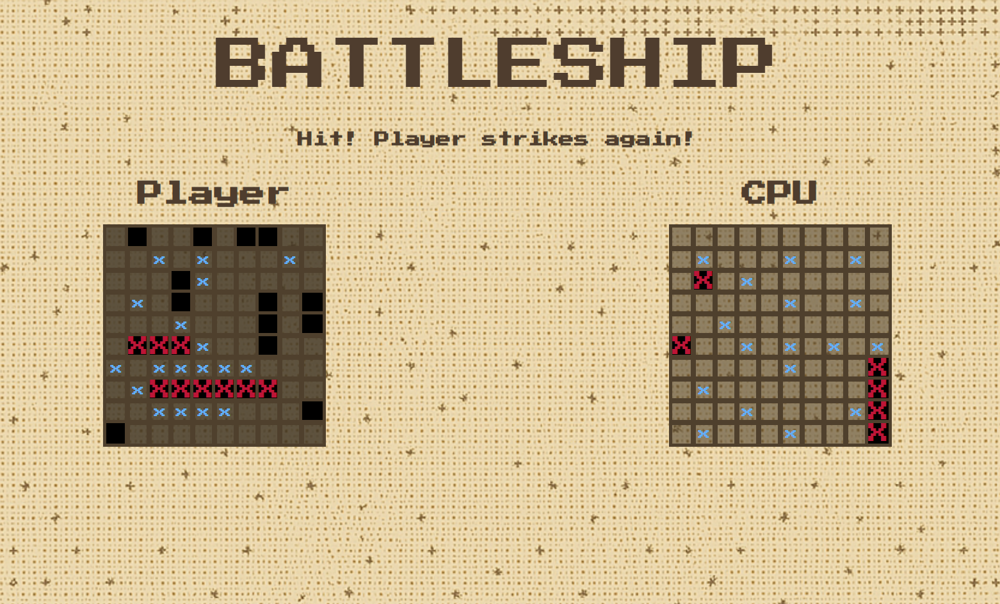

# About 

It's classic battleship game written in JavaScript, the final project of JavaScript course from [The Odin Project](https://www.theodinproject.com/). Here I learned Drag and Drop API and Test Driven Development.

## Features 

  * Drag and drop is implemented! 
  * Computer attacks using logic from separate class, not just random coordinates.
  * Cool arcade-like design.

---

---
  
  ## How to use

  You can try it right [here](https://nyanlight.github.io/battleship/), or clone it and run locally with ``` npm run dev ``` command. Enjoy :)
